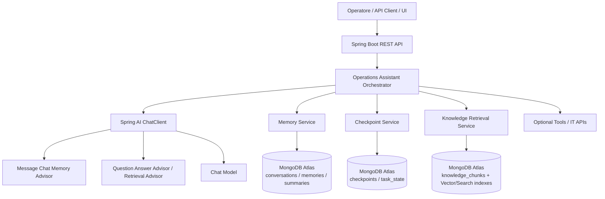

# Solution Design Step-by-Step — Spring AI Operations Assistant with MongoDB as Memory and State Store

## 1. Executive summary

Questa soluzione implementa un **Operations Assistant** per team IT/Operations usando **Spring AI** come orchestration layer lato Java e **MongoDB Atlas** come backend unificato per **knowledge retrieval**, **memoria dell’agente** e **persistenza dello stato operativo**. MongoDB Atlas supporta nativamente Vector Search e full-text search sullo stesso dataset, mentre Spring AI espone il vector store MongoDB Atlas e l’uso di advisor per combinare retrieval e memoria conversazionale nel flusso del `ChatClient`. citeturn3search34turn3search60

Il valore architetturale della demo non è soltanto mostrare una RAG app, ma dimostrare come trasformare un LLM stateless in un **assistente stateful** che: 1) recupera runbook e documentazione operativa, 2) conserva contesto conversazionale, 3) ricorda preferenze o fatti operativi persistenti, 4) salva checkpoint del workflow per riprendere task multi-step o interrotti. MongoDB definisce esplicitamente la memoria degli agenti come short-term e long-term memory, e nella sua integrazione con LangGraph separa con chiarezza **state persistence** e **long-term memory**, un modello concettuale molto utile anche se l’implementazione runtime della demo resta in Spring AI. citeturn1search15turn3search57turn3search58

---

## 2. Business scenario e obiettivi della demo

L’Operations Assistant supporta casi d’uso come: interpretazione di alert, ricerca di runbook, spiegazione di procedure operative, raccolta di dati necessari all’esecuzione, pianificazione di next steps e ripresa di un task interrotto. Gli agenti sono particolarmente adatti a task complessi che richiedono reasoning, decision making, strumenti esterni e memoria; MongoDB descrive infatti gli AI agent come sistemi che combinano perception, planning, tools e memory. citeturn1search15turn3search58

### Obiettivi funzionali

- Recuperare **knowledge operativa** (runbook, SOP, FAQ, postmortem, asset notes) tramite **semantic search** e, in una fase successiva, anche **hybrid search**. MongoDB supporta semantic search, full-text search e hybrid search combinando i risultati di più query sullo stesso dataset. citeturn3search43turn3search35turn3search40
- Mantenere **short-term conversational memory** per dare continuità alla sessione corrente. Spring AI fornisce advisor dedicati alla chat memory, mentre MongoDB sottolinea l’importanza della short-term memory per la coerenza contestuale. citeturn3search60turn1search15turn3search58
- Costruire una **long-term memory operativa** con preferenze, note persistenti, decisioni precedenti, sommari e fatti utili per sessioni future. MongoDB descrive la long-term memory come persistenza cross-session di preferenze, conversazioni e contesto rilevante. citeturn1search15turn3search58turn3search57
- Salvare **execution state / checkpoints** per sospendere e riprendere task multi-step. La separazione fra short-term state/checkpoint e long-term memory è esplicitata dalla documentazione MongoDB-LangGraph e abilita human-in-the-loop, time travel e fault tolerance. citeturn3search57turn1search3turn1search6

### Obiettivi non funzionali

- **Ridurre la complessità operativa** consolidando retrieval, memory e state nello stesso backend documentale. MongoDB evidenzia che usare lo stesso database per retrieval e memory semplifica l’architettura e riduce l’operational complexity. citeturn3search57turn3search58
- **Abilitare filtering e tenant isolation** usando metadata filter nei risultati vettoriali. MongoDB Vector Search consente pre-filtering su campi aggiuntivi indicizzati come `filter`. citeturn3search47turn3search34
- **Gestire dati effimeri** come checkpoint temporanei tramite TTL index. I TTL indexes rimuovono automaticamente documenti dopo un certo intervallo di tempo o a una specifica data/ora. citeturn3search51turn1search6

---

## 3. Scelta tecnologica

### Stack principale

- **Java 21 + Spring Boot** come application runtime. MongoDB raccomanda un ambiente Java e mostra esempi Spring Boot per l’integrazione con Spring AI. citeturn3search33turn3search34
- **Spring AI** come abstraction layer verso LLM, embeddings, vector store e advisor chain. Gli advisor Spring AI permettono di intercettare e arricchire richieste/risposte, incapsulando pattern come chat memory e RAG. citeturn3search60turn3search34
- **MongoDB Atlas** come backend unico per documenti operativi, embeddings, memorie e stato; Atlas supporta Vector Search e full-text search sullo stesso dataset documentale. citeturn3search34turn3search43
- **OpenAI-compatible embedding/chat model** oppure altro provider supportato da Spring AI; Spring AI richiede un `EmbeddingModel` configurato per il vector store MongoDB Atlas. citeturn3search34turn3search33

### Perché Spring AI e non solo repository custom

Spring AI offre il `MongoDBAtlasVectorStore`, proprietà di auto-configurazione, `ChatClient`, advisor chain e integrazione con la Observability stack. Questo consente di modellare un flusso a strati in cui la richiesta utente passa attraverso memoria conversazionale, retrieval contestuale e logging/tracing prima di arrivare al modello. citeturn3search34turn3search60

### Perché MongoDB come memory + state store

MongoDB non è soltanto un vector store: nella documentazione sugli agenti viene presentato come backend per **tools**, **short-term memory** e **long-term memory**, mentre l’integrazione con LangGraph aggiunge il pattern di **checkpointer** per lo stato di esecuzione e **store** per le memorie persistenti. Questo modello è ideale per un’architettura agentic anche quando l’orchestrazione applicativa è implementata in Spring AI. citeturn1search15turn3search57turn3search58

---

## 4. Visione architetturale ad alto livello

### High-level architecture

Questa architettura separa chiaramente il livello di **orchestrazione** dal livello di **storage semantico e documentale**. Spring AI gestisce il flusso conversazionale e il chaining degli advisor, mentre MongoDB Atlas funge da storage unificato per knowledge, memory e state. MongoDB e Spring AI documentano esplicitamente questi due ruoli: advisor e vector store lato Spring AI, tools/memory lato MongoDB. citeturn3search60turn3search34turn1search15

### Principio guida

La soluzione segue il principio: **retrieval risponde a “cosa deve sapere l’assistente adesso?”, memory risponde a “cosa ha imparato nel tempo?”, state risponde a “a che punto del task si trova?”**. MongoDB distingue short-term e long-term memory; l’integrazione con LangGraph aggiunge la nozione di state persistence/checkpoint per resume e fault tolerance. citeturn1search15turn3search57turn3search58

---

## 5. Componenti logici della soluzione

### 5.1 API Layer

Espone endpoint REST o SSE/WebSocket per:
- apertura o ripresa di una conversazione/task,  
- invio di richieste operative,  
- caricamento documentazione,  
- consultazione dello stato corrente,  
- chiusura o sospensione di un task.  
Il tutorial MongoDB per Spring AI mostra un application layer basato su controller Spring Boot che espone endpoint per ingestion e semantic search. citeturn3search33turn3search34

### 5.2 Operations Assistant Orchestrator

È il cuore applicativo. Decide il flusso della richiesta, coordina retrieval, memoria, checkpoint e chiamate al modello. MongoDB descrive il layer di planning degli agenti come il punto in cui LLM, prompt e feedback loop determinano il passo successivo, mentre Spring AI Advisors permette di incapsulare nel `ChatClient` le concern trasversali come memoria e RAG. citeturn1search15turn3search60

### 5.3 ChatClient + Advisors

`ChatClient` è il client Spring AI verso il modello. Gli advisor consentono di aggiungere comportamento al ciclo request/response, come:
- `MessageChatMemoryAdvisor` per iniettare la cronologia,  
- `QuestionAnswerAdvisor` o un advisor di retrieval custom per aggiungere contesto da vector store,  
- advisor custom per logging, governance, correlation ID, checkpoint decisions.  
Spring AI raccomanda di registrare gli advisor in build time tramite `defaultAdvisors()`. citeturn3search60

### 5.4 Knowledge Retrieval Service

Recupera contesto operativo dalla knowledge base usando `MongoDBAtlasVectorStore`. MongoDB Atlas supporta semantic search, full-text search e hybrid search, mentre Spring AI fornisce l’abstraction `VectorStore` con `similaritySearch()` e metadata filtering. citeturn3search34turn3search43turn3search35

### 5.5 Memory Service

Gestisce due livelli:
- **short-term memory**: cronologia conversazionale e contesto della sessione corrente;  
- **long-term memory**: fatti persistenti, preferenze, note operative, riassunti e decisioni rilevanti.  
MongoDB evidenzia che la memoria dell’agente può essere sia short-term sia long-term; Spring AI fornisce la gestione di chat memory, ma la long-term memory applicativa va modellata esplicitamente. citeturn1search15turn3search58turn3search60

### 5.6 Checkpoint / State Service

Mantiene il **task state**: step corrente, runbook selezionato, dati già raccolti, tool già invocati, pending actions, stato di approvazione, timestamp e versioni. MongoDB-LangGraph presenta questo pattern come checkpointer per la persistenza dello stato con supporto a human-in-the-loop e fault tolerance; nella nostra soluzione il pattern viene implementato con collection MongoDB dedicate e service applicativi Spring. citeturn3search57turn1search6

### 5.7 Ingestion Pipeline

Carica documenti operativi, li chunka, genera embeddings e li salva nella knowledge base. MongoDB documenta questo flusso sia nel tutorial Spring AI sia nel tutorial “Build AI Agents with MongoDB”. citeturn3search33turn1search15

### 5.8 Optional Tool Layer

Per rendere la demo davvero “agentic”, l’assistente può invocare tool esterni, ad esempio:
- ticketing API,  
- CMDB / inventory API,  
- status endpoint di servizi,  
- calcolo/analisi semplice.  
MongoDB definisce i tool come componenti programmaticamente invocabili dall’agente per raccogliere contesto o eseguire azioni. citeturn1search15

---

## 6. Modello dati MongoDB

Per mostrare in modo convincente memory e state, è consigliabile **non** limitarsi a una sola collection di embeddings. MongoDB supporta sia documenti operativi sia vettori nello stesso database, e questo rende naturale separare knowledge, conversazioni, memorie e checkpoint in collezioni distinte. citeturn3search34turn3search43turn3search57

### 6.1 `knowledge_chunks`

Scopo: contenere chunk documentali usati per semantic search e RAG. La reference Spring AI per MongoDB Atlas indica come schema minimo un documento con `id`, `content`, `metadata` ed `embedding`. citeturn3search34

**Campi proposti**
- `id`
- `documentId`
- `chunkId`
- `content`
- `embedding`
- `metadata.sourceType` (runbook, SOP, FAQ, alert-note)
- `metadata.system`
- `metadata.severity`
- `metadata.team`
- `metadata.environment`
- `metadata.tags`
- `createdAt`
- `updatedAt`

### 6.2 `conversations`

Scopo: short-term memory e audit trail della conversazione. MongoDB mostra esplicitamente il pattern con `session_id`, `role`, `content` e timestamp per la short-term memory. citeturn1search15

**Campi proposti**
- `conversationId`
- `userId`
- `role`
- `content`
- `toolCalls`
- `promptMetadata`
- `timestamp`

### 6.3 `memories`

Scopo: long-term memory riutilizzabile cross-session. MongoDB distingue più tipi di memoria agentica, incluse forme di working, episodic e semantic memory; in pratica possiamo modellare record persistenti con contenuto, metadata e opzionalmente embedding per recall semantico. citeturn3search58turn3search57

**Campi proposti**
- `memoryId`
- `userId` o `tenantId`
- `memoryType` (`preference`, `fact`, `summary`, `episode`, `decision`)
- `content`
- `embedding` (opzionale ma consigliato)
- `importanceScore`
- `sourceConversationId`
- `createdAt`
- `lastUsedAt`
- `expiresAt` (opzionale)

### 6.4 `checkpoints`

Scopo: persistere lo stato del workflow. La documentazione di `MongoDBSaver` per LangGraph descrive collection di checkpoint e pending writes con indici composti e TTL opzionale. citeturn1search6turn3search57

**Campi proposti**
- `checkpointId`
- `conversationId`
- `taskId`
- `workflowName`
- `currentStep`
- `status` (`RUNNING`, `WAITING_INPUT`, `WAITING_APPROVAL`, `COMPLETED`, `FAILED`)
- `stateData` (JSON con risultati intermedi)
- `pendingActions`
- `toolExecutionRefs`
- `createdAt`
- `updatedAt`
- `expiresAt`

### 6.5 `tool_executions`

Scopo: tracciare tool call e debugging operativo. La documentazione MongoDB sul checkpointer menziona anche la memorizzazione di “intermediate writes”; una collection esplicita per tool execution semplifica audit e troubleshooting. citeturn1search6turn3search57

**Campi proposti**
- `executionId`
- `conversationId`
- `taskId`
- `toolName`
- `requestPayload`
- `responsePayload`
- `status`
- `startedAt`
- `completedAt`

---

## 7. Strategia di indexing e ricerca

### 7.1 Vector index su `knowledge_chunks`

Spring AI può inizializzare lo schema MongoDB Atlas Vector Store automaticamente impostando `spring.ai.vectorstore.mongodb.initialize-schema=true`; la documentazione mostra anche i parametri principali come `collection-name`, `index-name`, `path-name` e i `metadata-fields-to-filter`. citeturn3search34turn3search33

Per il dataset `knowledge_chunks`, il path vettoriale consigliato è `embedding`, con campi metadata aggiuntivi abilitati al filtering. MongoDB Vector Search consente query semantiche con pre-filtering e richiede che i campi usati nel filtro siano definiti nel vector index come campi `filter`. citeturn3search47turn3search34

### 7.2 Index di full-text search (opzionale, fase 2)

Per query con forte componente lessicale (sigle, codici allarme, nomi host, ticket ID), conviene aggiungere un **MongoDB Search index** dedicato. MongoDB spiega che full-text search eccelle negli exact matches, mentre vector search cattura similarità semantica. citeturn3search35turn3search40

### 7.3 Hybrid search (fase 2 / opzionale)

MongoDB supporta hybrid search combinando `$vectorSearch` e `$search` e fondendo i risultati con `$rankFusion` o `$scoreFusion`; la documentazione segnala queste pipeline come funzionalità preview. Per l’MVP consigliamo semantic search + pre-filtering, lasciando hybrid search come miglioramento successivo. citeturn3search35turn3search40

### 7.4 Indici classici

Aggiungere indici classici su:
- `conversations.conversationId + timestamp`,  
- `memories.userId + memoryType + createdAt`,  
- `checkpoints.conversationId + updatedAt`,  
- `tool_executions.taskId + startedAt`.  
MongoDB ricorda che gli indici migliorano le query ma hanno impatto sulle write, quindi vanno progettati sui campi più usati nelle query e nei sort. citeturn3search52

### 7.5 TTL index per dati effimeri

Usare un TTL index su `checkpoints.expiresAt` e, se serve, su memorie effimere o conversation fragments. I TTL indexes sono single-field indexes che rimuovono automaticamente i documenti dopo un intervallo o a una data specifica; MongoDB raccomanda attenzione quando si creano TTL index su grandi volumi di dati esistenti. citeturn3search51

---

## 8. Pattern di memoria e stato nella demo

### 8.1 Short-term memory

Serve a preservare continuità entro la conversazione corrente. In Spring AI può essere gestita con `ChatMemory` + `MessageChatMemoryAdvisor`; in MongoDB può essere persa su `conversations` per audit e replay. Spring AI mostra esplicitamente come usare `MessageChatMemoryAdvisor` con `ChatClient`, mentre MongoDB sottolinea che la short-term memory contiene ultimi turni e active task context. citeturn3search60turn1search15turn3search58

### 8.2 Long-term memory

Non coincide con tutta la chat history. Va costruita estraendo solo ciò che merita persistenza: preferenze operative, decisioni frequenti, mappature ambiente-servizio, note utili per sessioni successive, sintesi di incidenti ricorrenti. MongoDB descrive la long-term memory come persistenza cross-session e mette in evidenza memory engineering, lifecycle management e retrieval selettivo. citeturn3search58turn3search57

### 8.3 Execution state

È diverso dalla memory. Lo stato descrive *dove si trova il workflow*: step corrente, informazioni mancanti, tool eseguiti, risultati parziali, eventuale attesa di approvazione. La documentazione MongoDB-LangGraph definisce esplicitamente il checkpointer come persistenza dello stato agente per short-term state, human-in-the-loop e fault tolerance. citeturn3search57turn1search6

### 8.4 Perché tenere separati memory e state

Separare memory e state evita di trattare la cronologia grezza come unica fonte di verità. È un pattern coerente con l’architettura MongoDB-LangGraph, dove **checkpointer** e **store** hanno responsabilità differenti ma complementari. citeturn3search57

---

## 9. Step-by-step design della soluzione

## Step 1 — Preparare il progetto Spring Boot

Creare un progetto Spring Boot con dipendenze Spring Web, Spring Data MongoDB, modello chat/embedding scelto e starter `spring-ai-starter-vector-store-mongodb-atlas`. La reference Spring AI indica questo starter come entry point per usare Atlas come vector store. citeturn3search34

**Output atteso**
- skeleton Spring Boot,  
- configurazione `application.yml`,  
- bean `ChatClient`, `EmbeddingModel`, `VectorStore`,  
- connessione a MongoDB Atlas.  
Spring AI documenta anche la possibilità di auto-configurare il vector store e di esporre `VectorStore` come bean direttamente in application context. citeturn3search34turn3search33

## Step 2 — Definire `application.yml`

Configurare:
- `spring.data.mongodb.uri`,  
- `spring.data.mongodb.database`,  
- `spring.ai.vectorstore.mongodb.collection-name`,  
- `spring.ai.vectorstore.mongodb.index-name`,  
- `spring.ai.vectorstore.mongodb.path-name`,  
- `spring.ai.vectorstore.mongodb.initialize-schema`,  
- `spring.ai.vectorstore.mongodb.metadata-fields-to-filter`.  
Queste proprietà sono descritte nella reference Spring AI per MongoDB Atlas. citeturn3search34

## Step 3 — Modellare le collection MongoDB

Creare le collection: `knowledge_chunks`, `conversations`, `memories`, `checkpoints`, `tool_executions`. MongoDB Atlas consente di gestire embeddings e documenti operativi nello stesso database, semplificando la convergenza di retrieval, memory e state. citeturn3search43turn3search57

## Step 4 — Implementare l’ingestion pipeline

Pipeline consigliata:
1. caricare documenti (runbook, SOP, FAQ, postmortem),  
2. chunking,  
3. generazione embeddings,  
4. salvataggio in `knowledge_chunks`,  
5. attesa della queryability dell’indice prima di abilitare le query.  
MongoDB documenta ingestion + creazione di vector index e ricorda che gli indici vector sono **eventually consistent**, quindi i dati più recenti potrebbero non essere immediatamente disponibili. citeturn3search33turn3search47

## Step 5 — Configurare il `MongoDBAtlasVectorStore`

Usare il `VectorStore` Spring AI per le query semantiche. La reference mostra sia auto-configurazione sia configurazione manuale con builder, inclusi `numCandidates`, `pathName`, campi filtrabili e schema initialization. citeturn3search34

## Step 6 — Costruire il `ChatClient` con advisor chain

Configurare il `ChatClient` con almeno due advisor:
- `MessageChatMemoryAdvisor` per la short-term memory,  
- `QuestionAnswerAdvisor` (o advisor custom equivalente) per il retrieval contestuale.  
Spring AI mostra esplicitamente questa combinazione nella documentazione degli Advisors API. citeturn3search60

## Step 7 — Implementare un `MemoryService`

Il `MemoryService` deve fare tre cose:
1. salvare la cronologia della sessione corrente in `conversations`,  
2. estrarre fatti persistenti e salvarli in `memories`,  
3. recuperare memorie long-term rilevanti da aggiungere al contesto quando serve.  
MongoDB chiarisce che la long-term memory può includere preferenze, conversazioni passate e contesto personalizzato, e che Search/Vector Search possono essere usati per interrogare interazioni importanti tra sessioni. citeturn1search15turn3search58

## Step 8 — Implementare un `CheckpointService`

Il `CheckpointService` crea e aggiorna documenti in `checkpoints` ogni volta che il workflow avanza di stato. Campi chiave: `currentStep`, `status`, `stateData`, `pendingActions`, `updatedAt`. Il pattern è coerente con la logica di `MongoDBSaver` per LangGraph, che salva checkpoint e intermediate writes per thread/namespace. citeturn1search6turn3search57

## Step 9 — Definire il workflow operativo dell’assistente

Workflow consigliato per la demo:
1. l’operatore descrive un problema operativo,  
2. il sistema crea o riprende una `conversationId`,  
3. il `ChatClient` riceve short-term memory,  
4. il retrieval cerca chunk rilevanti nella knowledge base,  
5. il `MemoryService` recupera eventuali memorie persistenti rilevanti,  
6. il modello propone azioni o chiede dati mancanti,  
7. il `CheckpointService` salva lo stato,  
8. la sessione può essere sospesa e ripresa.  
Questo schema riflette i componenti perception/planning/tools/memory definiti da MongoDB per gli agenti. citeturn1search15turn3search57

## Step 10 — Supportare pause/resume

La demo deve mostrare esplicitamente un task interrotto e poi ripreso. Alla ripresa, il sistema legge l’ultimo checkpoint associato alla `conversationId` e ricostruisce lo stato corrente del task. Questo è il punto dimostrativo più forte perché rende visibile la differenza tra semplice chatbot e agente stateful. MongoDB-LangGraph collega la state persistence a resume, human-in-the-loop e fault tolerance. citeturn3search57turn1search6

## Step 11 — Consolidare memoria a fine sessione

Quando un task si chiude, il sistema può generare un **summary** e salvare solo le informazioni durevoli in `memories`, evitando di trattare tutta la chat history come memoria permanente. MongoDB distingue chiaramente tra session history e long-term memory, e la sua guida su Agent Memory sottolinea la necessità di memory engineering e selezione di ciò che deve diventare memoria. citeturn1search15turn3search58

## Step 12 — Osservabilità e tracing

Spring AI specifica che gli advisor partecipano allo stack di observability, quindi conviene tracciare:
- execution time degli advisor,  
- hit/miss del retrieval,  
- numero di tool call,  
- numero di checkpoint creati/aggiornati,  
- latenza totale per richiesta.  
Spring AI documenta il coinvolgimento degli advisors nella observability stack; MongoDB, dal canto suo, enfatizza l’importanza dell’architettura consolidata per semplificare operation e debugging. citeturn3search60turn3search57

---

## 10. Flusso runtime della demo

### Scenario: “Investigate high CPU alert on service X”

1. L’operatore invia: “Sto analizzando un alert di high CPU sul servizio X in produzione”.  
2. L’API layer crea o recupera la `conversationId`.  
3. `MessageChatMemoryAdvisor` inietta la storia recente della conversazione.  
4. Il retrieval esegue una semantic search su `knowledge_chunks` filtrando per `system=service-X` e `environment=prod`, a condizione che questi campi siano indicizzati come `filter`.  
5. Il `MemoryService` recupera memorie persistenti come “per questo servizio il primo controllo è il consumo del worker Y”.  
6. Il modello genera la risposta con contesto operativo e suggerisce i prossimi step.  
7. Il `CheckpointService` salva `currentStep=CHECK_CPU_RUNBOOK`, i dati già raccolti e le pending actions.  
8. L’utente interrompe la sessione.  
9. In una seconda sessione, l’utente scrive “riprendiamo l’analisi di prima”.  
10. Il sistema recupera l’ultimo checkpoint e continua dal punto corretto.  
Questo comportamento è coerente con l’uso di short-term memory, long-term memory, pre-filtering e checkpoint persistence descritto dalle fonti MongoDB e Spring AI. citeturn3search60turn3search47turn3search57turn1search15

---

## 11. API e contratti applicativi suggeriti

### Endpoint minimi

- `POST /api/ops/chat` — invia un messaggio alla conversazione corrente.  
- `POST /api/ops/chat/{conversationId}/resume` — riprende una conversazione/task esistente.  
- `GET /api/ops/chat/{conversationId}/state` — legge lo stato/checkpoint corrente.  
- `POST /api/ops/knowledge/ingest` — avvia ingestion di documenti operativi.  
- `GET /api/ops/memories/{userId}` — elenca le memorie persistenti.  
La scelta di esporre endpoint separati per ingestion e query è coerente con il tutorial MongoDB Spring AI che mostra endpoint distinti per add/search e con il pattern di separate responsibilities fra retrieval, memory e state. citeturn3search33turn3search57

### DTO chiave

- `ChatRequest(conversationId, userId, message, contextOverrides)`  
- `ChatResponse(conversationId, answer, currentStep, suggestedActions)`  
- `CheckpointDto(conversationId, taskId, currentStep, status, pendingActions)`  
- `IngestionRequest(sourceType, uri, tags, environment, system)`  
Questi DTO derivano direttamente dalla struttura dei flussi descritti sopra e dal pattern di stateful conversations documentato da MongoDB. citeturn1search15turn3search57

---

## 12. Scelte implementative consigliate per la demo MVP

### MVP scope

Per l’articolo e la demo iniziale, consiglio di implementare:
- semantic search su `knowledge_chunks`,  
- `MessageChatMemoryAdvisor` per short-term memory,  
- `MemoryService` custom per long-term memory,  
- `CheckpointService` custom con TTL sui checkpoint,  
- un solo tool esterno mockato o semplice (ad esempio status API),  
- una demo pause/resume.  
Questo scope è sufficiente a dimostrare retrieval, memory e state nello stesso backend senza introdurre troppa complessità. La progressione è coerente con le capacità ufficiali di Spring AI advisors, MongoDB Vector Search e con il pattern checkpointer/store della documentazione MongoDB-LangGraph. citeturn3search60turn3search34turn3search57

### Cosa lasciare alla fase 2

- hybrid search con `$rankFusion` o `$scoreFusion`,  
- semantic cache,  
- più tool esterni,  
- reranking,  
- dashboard di observability avanzata.  
MongoDB segnala l’hybrid search fusion come preview; per questo è preferibile introdurla dopo aver stabilizzato semantic search e metadata filtering. citeturn3search35turn3search40

---

## 13. Rischi e mitigazioni

### Rischio 1 — Filtri vettoriali non funzionanti

Se si usa filtering sui metadata senza averli definiti nel vector index come `filter`, la query fallisce o non si comporta come previsto. MongoDB richiede esplicitamente che i campi usati per pre-filtering siano indicizzati come `filter`. citeturn3search47turn3search34

**Mitigazione**: definire da subito i metadata filtrabili (`system`, `environment`, `team`, `severity`) nelle proprietà Spring AI e nell’indice MongoDB. citeturn3search34turn3search47

### Rischio 2 — Confusione fra chat history e long-term memory

Salvare tutta la conversazione come memoria permanente degrada qualità e governabilità. MongoDB distingue nettamente between session context e long-term memory e descrive la memory engineering come disciplina separata. citeturn1search15turn3search58

**Mitigazione**: introdurre una fase di summarization/consolidation e salvare solo memorie con `memoryType` e `importanceScore`. citeturn3search58

### Rischio 3 — Stato del workflow non persistito

Se non si salvano checkpoint espliciti, l’assistente torna a essere un chatbot stateless che non può riprendere task complessi. La documentazione MongoDB-LangGraph evidenzia che state persistence è ciò che abilita human-in-the-loop, time travel e fault tolerance. citeturn3search57turn1search6

**Mitigazione**: introdurre `CheckpointService` fin dall’MVP. citeturn3search57

### Rischio 4 — Indicizzazione e consistenza

Gli indici vector sono eventually consistent; documenti nuovi o aggiornati potrebbero non essere interrogabili immediatamente. MongoDB lo dichiara esplicitamente nella documentazione sull’indicizzazione dei campi per Vector Search. citeturn3search47

**Mitigazione**: polling di readiness dopo ingestion, oppure pipeline asincrona con stato `INGESTED_NOT_QUERYABLE` → `QUERYABLE`. citeturn3search47turn3search33

---

## 14. Piano di implementazione consigliato

### Fase 1 — Foundation

- progetto Spring Boot + Spring AI + MongoDB Atlas,  
- configurazione `VectorStore`,  
- ingestion documenti,  
- endpoint di test per retrieval.  
Questa fase segue molto da vicino il tutorial ufficiale MongoDB su Spring AI. citeturn3search33turn3search34

### Fase 2 — Conversational layer

- `ChatClient`,  
- `MessageChatMemoryAdvisor`,  
- persistenza `conversations`,  
- endpoint `/chat`.  
Spring AI documenta l’uso del memory advisor direttamente sul `ChatClient`. citeturn3search60

### Fase 3 — Long-term memory

- `memories` collection,  
- estrazione facts/preferences/summaries,  
- retrieval semantico sulle memorie.  
MongoDB documenta la long-term memory come memoria persistente cross-session e la collega a retrieval semantico e metadata filtering. citeturn1search15turn3search57turn3search58

### Fase 4 — State persistence

- `checkpoints` collection,  
- `CheckpointService`,  
- endpoints di resume e state inspection,  
- demo di task interrotto.  
Il pattern è coerente con la documentazione sul MongoDB checkpointer per LangGraph. citeturn3search57turn1search6

### Fase 5 — Hardening

- TTL index,  
- observability,  
- auth/tenant filters,  
- eventual hybrid search.  
MongoDB documenta TTL, filtering e hybrid search come estensioni importanti della base semantic search. citeturn3search51turn3search47turn3search40

---

## 15. Conclusione

Il disegno della soluzione per l’**Operations Assistant** deve dimostrare che **MongoDB Atlas non è soltanto il luogo dove salvare embeddings**, ma il **backend unificato** dove convergono **knowledge retrieval**, **short-term memory**, **long-term memory** e **execution state**. Spring AI fornisce il layer Java ideale per orchestrare il flusso con `ChatClient`, advisors e vector store, mentre MongoDB offre il piano dati necessario per rendere l’assistente realmente stateful. citeturn3search34turn3search60turn3search57turn3search58

Se la demo mostra semantic retrieval, memoria conversazionale, consolidamento in long-term memory e resume di un task tramite checkpoint, allora sostiene in modo credibile la tesi dell’articolo: **MongoDB come memory e state store per agentic workflows autonomi**. citeturn1search15turn3search57turn3search58
